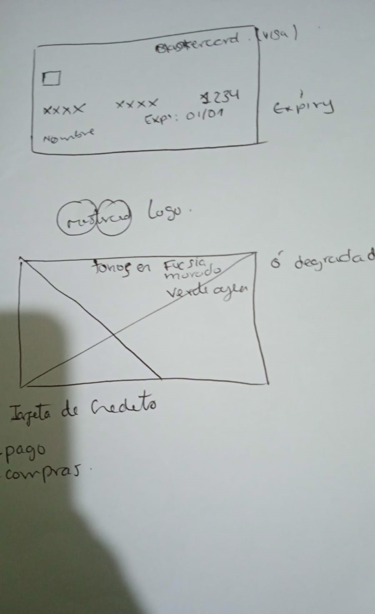
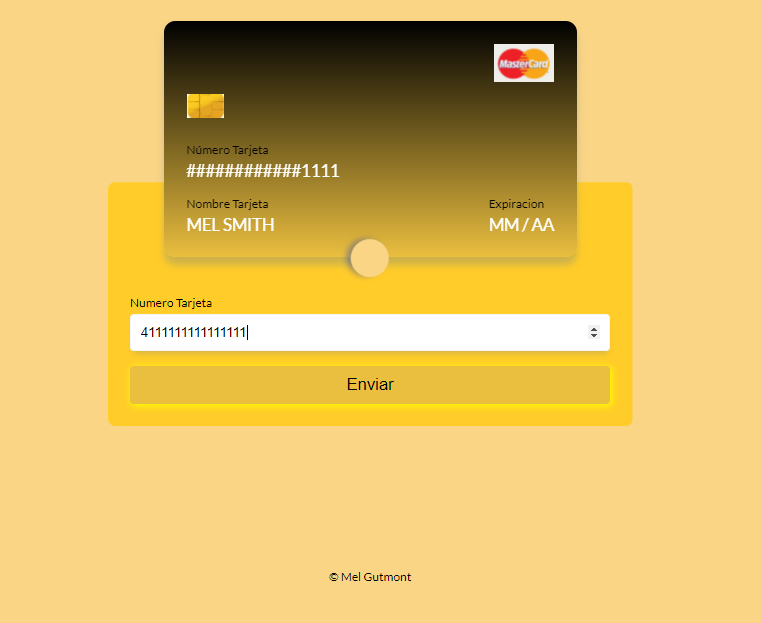
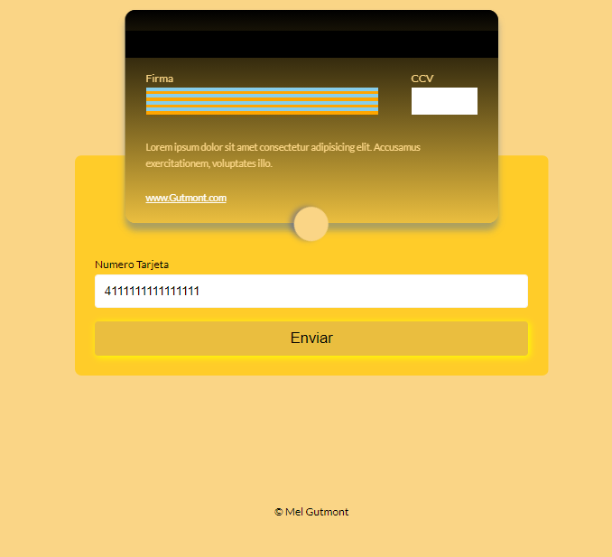
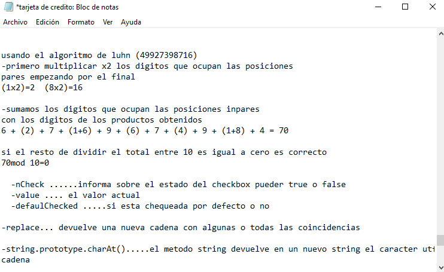

# Gutmont Validation

## Índice

* [1. Preámbulo](#1-preámbulo)
* [2. Resumen del proyecto](#2-resumen-del-proyecto)
* [3. Objetivos de aprendizaje](#3-objetivos-de-aprendizaje)
* [4. Consideraciones generales](#4-consideraciones-generales)
* [5. Criterios de aceptación mínimos del proyecto](#5-criterios-de-aceptación-mínimos-del-proyecto)
* [6. Consideraciones técnicas](#7-consideraciones-técnicas)
* [7. Pistas, tips y lecturas complementarias](#8-pistas-tips-y-lecturas-complementarias)


***

## 1. Preámbulo

El [algoritmo de Luhn](https://es.wikipedia.org/wiki/Algoritmo_de_Luhn),
también llamado algoritmo de módulo 10, es un método de suma de verificación,
se utiliza para validar números de identificación; tales como el IMEI de los
celulares, tarjetas de crédito, etc.

Este algoritmo es simple. Obtenemos la reversa del número a verificar (que
solamente contiene dígitos [0-9]); a todos los números que ocupan una posición
par se les debe multiplicar por dos, si este número es mayor o igual a 10,
debemos sumar los dígitos del resultado; el número a verificar será válido si
la suma de sus dígitos finales es un múltiplo de 10.

[](https://www.youtube.com/watch?v=f0zL6Ot9y_w)

### 2. Resumen del proyecto

En este proyecto es una aplicación web que le permita al
usuario validar el número de una tarjeta de crédito. Además, tiene la  funcionalidad para ocultar todos los dígitos de una tarjeta menos los últimos cuatro.

#### 3. Objetivos de aprendizaje

Aprender construir una aplicación web que interactue con lx usuarix final a través del navegador, utilizar HTML, CSS y JavaScript .

##### 4. Consideraciones generales

### HTML y CSS

* [X] [Uso de HTML semántico.](https://developer.mozilla.org/en-US/docs/Glossary/Semantics#Semantics_in_HTML)
* [X] Uso de selectores de CSS.
* [X] Construir tu aplicación respetando el diseño realizado (maquetación).

### DOM

* [X] Uso de selectores del DOM.
* [X] Manejo de eventos del DOM.
* [X] [Manipulación dinámica del DOM.](https://developer.mozilla.org/es/docs/Referencia_DOM_de_Gecko/Introducci%C3%B3n)
(appendChild |createElement | createTextNode| innerHTML | textContent | etc.)

### JavaScript

* [X] Manipulación de strings.
* [X] Uso de condicionales (if-else | switch | operador ternario)
* [X] Uso de bucles (for | for..in | for..of | while)
* [X] Uso de funciones (parámetros | argumentos | valor de retorno)
* [X] Declaración correcta de variables (const & let)

### Testing

* [ ] [Testeo unitario.](https://jestjs.io/docs/es-ES/getting-started)

### Estructura del código y guía de estilo

* [X] Organizar y dividir el código en módulos (Modularización)
* [] Uso de identificadores descriptivos (Nomenclatura | Semántica)
* [X] Uso de linter (ESLINT)

### Git y GitHub

* [X] Uso de comandos de git (add | commit | pull | status | push)
* [X] Manejo de repositorios de GitHub (clone | fork | gh-pages)

### UX

* [ ] Diseñar la aplicación pensando y entendiendo al usuario.
* [X] Crear prototipos para obtener feedback e iterar.
* [X] Aplicar los principios de diseño visual (contraste, alineación, jerarquía)


## 5. Criterios de aceptación mínimos de la aplicacion

Usa solo caracteres numéricos (dígitos) en la tarjeta a validar [0-9].

### Definición del producto

* Los usuarios de la aplicacion son mayores de 18 años .
* Los objetivos son que el usuario pueda validar su tarjeta y pueda        gestionar su pago o compra de lo que desee.
* La aplicacion resuelve el problema del tiempo para el usuario ya que hace mas sencilla y rapida un pago o una compra desde la comodidad de su hogar.


### Interfaz de usuario (UI)

La interfaz debe permitir al usuario:

* Insertar el número que queremos validar.
* Ver el resultado si es válido o no.
* Ocultar todos los dígitos de su número de tarjeta menos los últimos
4 caracteres.
* No debe poder ingresar un campo vacío.

#### Foto del primer prototipo  


#### Feedback recibido 
 Del feedback recibido se hicieron las mejores de css .

##### Imagen del prototipo final 





### Plan de accion 
- Los Objetivos de Aprendizaje a prioritizar, inplementar mejor la logica en js , investigar mas sobre css, entender y inplementar el algoritmo de Lunh.


##### `src/index.html`

En este archivo va el contenido que se mostrará al usuario (esqueleto HTML).
Encontrarás 3 etiquetas iniciales, las cuales si deseas puedes borrar y empezar
de cero:

* `<header>`: encabezado de tu proyecto.
* `<main>`: contenido principal de tu proyecto.
* `<footer>`: pie de página de tu proyecto.

##### `src/style.css`

Este archivo contine las reglas de estilo. 

#### Funcionalmente (JavaScript - pruebas unitarias)

* La lógica del proyecto debe estar implementada completamente en JavaScript.
* En este proyecto NO está permitido usar librerías o frameworks, sólo JavaScript
puro también conocido como Vanilla JavaScript.
* No se debe utilizar la _pseudo-variable_ `this`.

Vas a tener 2 archivos JavaScript separando responsabilidades, a continuación
indicamos qué harás en cada archivo:

##### `src/validator.js`

Acá se muestran las funciones necesarias para que el usuario pueda verificar la
tarjeta de crédito y ocultar los dígitos de su número de tarjeta.

* **`validator.isValid(creditCardNumber)`**: `creditCardNumber` es un `string`
con el número de tarjeta que se va a verificar. Esta función debe retornar un
`boolean` dependiendo si es válida de acuerdo al algoritmo de Luhn

* **`validator.maskify(creditCardNumber)`**: `creditCardNumber` es un `string` con
el número de tarjeta y esta función debe retornar un `string` donde todos menos
los últimos cuatro caracteres sean reemplazados por un numeral (`#`) o 🐱.
Esta función deberá siempre mantener los últimos cuatro caracteres intactos, aún
cuando el `string` sea de menor longitud.

    Ejemplo de uso

    ```js
    maskify('4556364607935616') === '############5616'
    maskify(     '64607935616') ===      '#######5616'
    maskify(               '1') ===                '1'
    maskify(               '')  ===                ''
    ```

##### `src/index.js`

Acá esta todo el código que tiene que ver con la interacción del DOM
(seleccionar, actualizar y manipular elementos del DOM y eventos).
Es decir, en este archivo esta las funciones `isValid` y `maskify`


##### `test/validator.spec.js`

En este archivo estan las pruebas unitarias de las funciones
`validator.isValid(creditCardNumber)` y `validator.maskify(creditCardNumber)`
implementadas en `validator.js` utilizando [Jest](https://jestjs.io/es-ES/).
Tus pruebas unitarias deben dar un 70% en _coverage_ (cobertura),
_statements_ (sentencias), _functions_ (funciones) y _lines_ (líneas); y un
mínimo del 50% de _branches_ (ramas).

***


## 6. Consideraciones técnicas

La lógica del proyecto esta  implementada completamente en JavaScript. 

Los tests unitarios :


```  validator.isValid
      √ debería ser una función
      √ debería retornar true para "4083952015263" (1 ms)
      √ debería retornar true para "79927398713" (30 ms)
      √ debería retornar false para "1234567890"
    validator.maskify
      √ debería ser una función (1 ms)
      √ Debería retornar "############5616" para "4556364607935616" (2 ms)
      √ Debería retornar "1" para "1" (1 ms)
      √ Debería retornar "helloworld" para  "helloworld" (1 ms)

--------------|---------|----------|---------|---------|-------------------
File          | % Stmts | % Branch | % Funcs | % Lines | Uncovered Line #s 
--------------|---------|----------|---------|---------|-------------------
All files     |   95.45 |       90 |     100 |     100 | 
 validator.js |   95.45 |       90 |     100 |     100 | 6
--------------|---------|----------|---------|---------|-------------------
Test Suites: 1 passed, 1 total
Tests:       9 passed, 9 total
Snapshots:   0 total
Time:        26.231 s

```

### Recursos y temas relacionados

Metodología para empezar a desarrollar tareas con JavaScript:

[](https://www.youtube.com/watch?v=lYfEmhLmu7A)

[Link](https://www.youtube.com/watch?v=lYfEmhLmu7A)

Terminal y shell de UNIX:

[](https://www.youtube.com/playlist?list=PLiAEe0-R7u8nGH5TEHfSTeDNIvjZFe_Yd)

[Link](https://www.youtube.com/playlist?list=PLiAEe0-R7u8nGH5TEHfSTeDNIvjZFe_Yd)

Control de versiones y trabajo colaborativo con Git y GitHub:

[](https://www.youtube.com/playlist?list=PLiAEe0-R7u8k9o3PbT3_QdyoBW_RX8rnV)

[Link](https://www.youtube.com/playlist?list=PLiAEe0-R7u8k9o3PbT3_QdyoBW_RX8rnV)

Diseño de experiencia de usuario (User Experience Design):

* Ideación
* Prototipado (sketching)
* Testeo e Iteración

Desarrollo Front-end:

* Valores
* Tipos
* Variables
* Control de flujo
* Tests unitarios
* [Documentación de NPM](https://docs.npmjs.com/)

#### Organización del Trabajo:

* Con la plicacion Trello


 
 * con bloc de notas para apuntes 


 


### Parte Obligatoria

* [X] `README.md` incluye info sobre proceso y decisiones de diseño.
* [X] `README.md` explica claramente quiénes son los usuarios y su relación con
  el producto.
* [ ] `README.md` explica claramente cómo el producto soluciona los
  problemas/necesidades de los usuarios.
* [ ] `README.md` (o otro archivo) contiene tu plan de acción - Objetivos que prioritizaste este proyecto.
* [X] Usa VanillaJS.
* [X] No utiliza `this`.
* [X] Implementa `validator.isValid`.
* [X] Implementa `validator.maskify`.
* [ ] Pasa linter con configuración provista.
* [X] Pasa pruebas unitarias.
* [X] Pruebas unitarias cubren 70% de _statements_, _functions_ y _lines_, y un
  mínimo del 50% de _branches_.
* [X] Interfaz permite escribir un número para ser validado.
* [X] Interfaz muestra el resultado de la validación correctamente.
* [X] Interfaz oculta todos los números escritos excepto los 4 últimos

